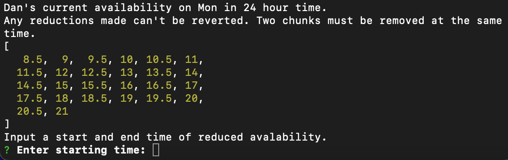

# LitScheduleBuilder

## **Project Discription**
A simple custom-made command line interface (CLI) that automates the assignment of students (or employees) to shifts.

## **Installation Instructions**
1) Install node.js at https://nodejs.org/en/download or by installing it using a package manager in your shell.
2) Verify node is installed by opening your shell of choice and typing node.
	- To exit node, input ctrl-C twice.
2) Download the code in a zip from this repository
3) Extract the downloaded zip in your desired location.
4) Cd into the repository contents and run node nodeInterface.js

## **Interpretation/Using the CLI**

### **Main Menu**

When you first run the node script, you will be shown the main menu:

This is where you can select between three different menus.
To navigate: use the up and down arrow keys or j (down) k (up).
To select/input values: hit enter

### **Students**

The student menu is where you will input and modify when students are avaliable to work in a given week.

*Selecting students*

In certain menus, you will need to select a specific student. To select a student, you input the number to the left of a student's name.

*Reducing avaliablity*

Each entry in a list represents a specific time of day in a 24 hour format. For instance 8.5 translates to 8:30AM. 14 is 2:00PM. Each entry is sperated by 30 minutes. To reduce a range of avaliability for a student on a specific day, you input the time intervals you want to remove. 

For instance, a student is busy from 4:00PM to 6:00PM on Monday, you input 16, 18 into the interface. This will remove those times in the student's schedule and will help in determining if a student is avaliable for a given shift.

### **Shifts**

The shift menu is where you can add and remove shifts. Creating shifts will be done in sequential steps. 1) Name the shift, 2) Set what day of the week the shift takes place, 3) Set the time the shift takes place. Setting the timing of the shift is similar to reducing the avalability of a student.

The following is a sample of how shifts are displayed.

### **Generate Assignments**

In this menu, you can generate the assignments of shifts to students.

This is a sample of what will be generated.

Shifts will be listed in order from the start to end of the week. It details who should be assigned to the shift, and who is the top 3 best candidates to take the shift. Additionally next to each shift, it states "number of blocks" indicating how many 30 minute chunks of time are in the given shift. The top 3 students displays how many chunks align with the number of chunks in the shift.

### **Additional Notes**
When you save shifts or students, when the script is re-run, the shifts and students will automatically be loaded into the program on start up.