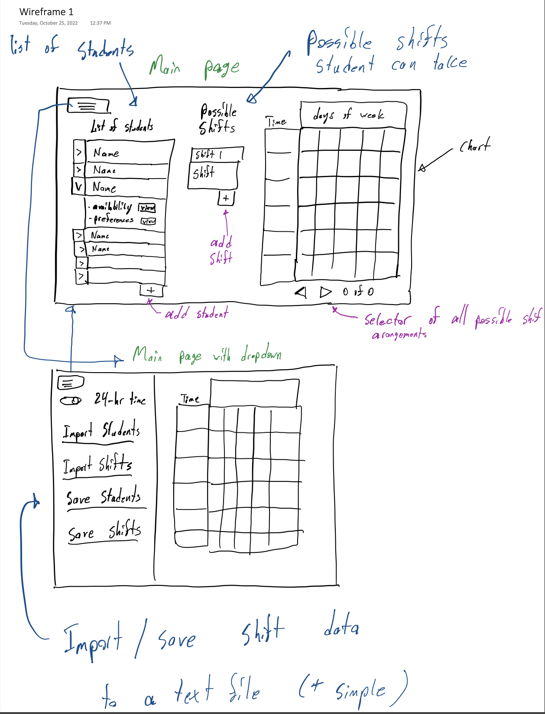
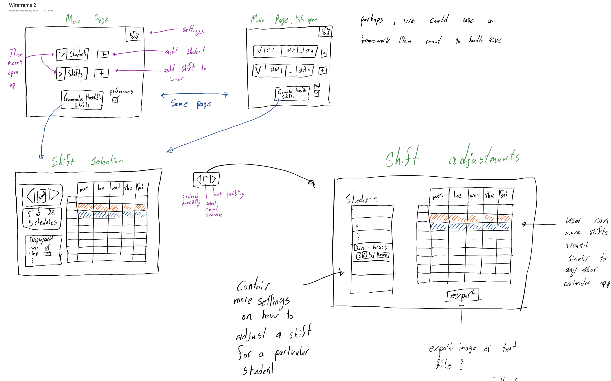

## Wireframes

### Wireframe 1

Features:
- More designed for webapp
- Text file inport/export for student data and shift data
- Calendar that automatically assigns shifts as data is added (Like VSB with courses)
- Dropdown menu on the topleft
- Adding/Removing of Possible shifts
- Adding/Removing of Possible students
- More features of calandar TBD
- More TBD

### Wireframe 2

Features:
- More designed for desktop app
- Automatically save files locally for student/shift data
- Generate shift first, then modify
- Settings drop down TBD features
- Modification of shifts/timing
- Possible export button?

## Reference Websites

### when2meet reference
.png)
- Simple aesthetic

.png)
- Spread sheet design for scheduling students 

### YorkU Visual Schedule Builder reference

- Functionality reference: Uses pins to hold an event/course in place
- Allows navigation of all possible results
- Grey spaces are reserved time